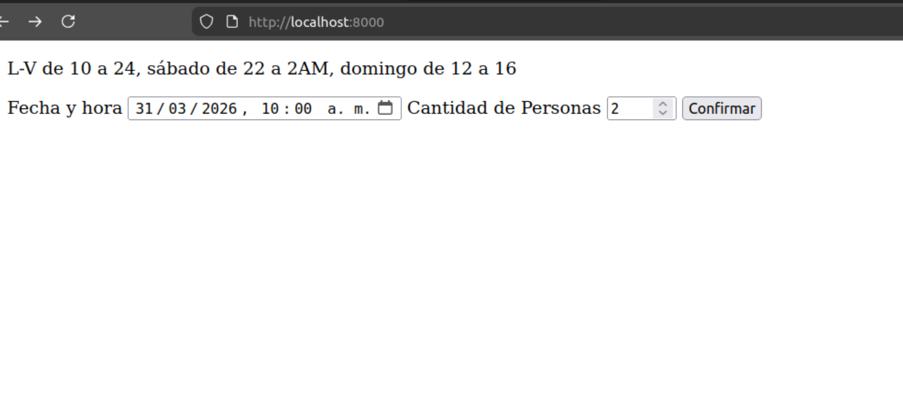

# Evaluacion Tecnica - MSI Group

### Enunciado
 1. ABM de Mesas (Ubicación [A, B, C, D], Numero de mesa, cantidad de personas)
2. Login/registro de usuarios
3. Solicitud de reserva, fecha, hora [L-V de 10 a 24, sábado de 22 a 2AM, domingo de 12 a 16], cantidad de personas. Se pueden unir mesas en la misma Ubicación. Usar cache en memoria de la disponibilidad por ubicación. La duración de las reservas es por default por 2 horas y la ubicación la debe definir el sistema (por orden) y se puede reservar hasta 15 minutos antes. Máximo 3 mesas por reserva
4. Listado por fecha, que muestre las reservas por ubicación y sección incluyendo que mesas en una sola consulta SQL optima
- Consigna: Hacer el punto 3 y 4.

### Comandos
- php -S localhost:8000
- sqlite3 database.db
### Se requiere
- php
- SQLite3 para php

### Diagrama de entidad-relación


- Decidi que:
    - Un usuario puede hacer varias reservas
    - En una reserva puede haber muchas mesas y una mesa puede estar en muchas reservas, por lo que agregue una tabla intermedi llamada "reserva_mesa".
    - Una mesa tiene un id y un numero, esto para que en cada ubicacion se tenga mesas de la 1 a la n. Esto por si en un futuro se agregan nuevas mesas en la ubicacion.
    - Las entidades y los atributos son minimos.
    - Como el enunciado dice que las reservas son "por default 2 horas" decidi que el usuario no puede ingresar la cantidad de horas.

### Sobre el proyecto

Este proyecto cuenta con las carpetas: modelos, repositorios, assets, servicios,controllers. Un archivo index.js y un archivo database.db.

Para el manejo de cache utilice un array estatico que guarda la informacion del lado del servidor, esto para poder hacer el proyecto con php puro (posición a la que me estoy postulando).

### Base de datos

```
CREATE TABLE Usuario (usuario_id INTEGER PRIMARY KEY AUTOINCREMENT, nombre VARCHAR(255) NOT NULL);

CREATE TABLE Reserva (reserva_id  INTEGER PRIMARY KEY AUTOINCREMENT, cantidad_de_personas INT NOT NULL, fecha_creacion TIMESTAMP NOT NULL,fecha_inicio TIMESTAMP NOT NULL, fecha_fin TIMESTAMP NOT NULL, usuario_id INT, FOREIGN KEY(usuario_id) REFERENCES usuario(usuario_id));

CREATE TABLE  Mesa (mesa_id  INTEGER PRIMARY KEY AUTOINCREMENT, num_mesa INT NOT NULL, cant_lugares INT NOT NULL,ubicacion_id INT,  FOREIGN KEY(ubicacion_id) REFERENCES ubicacion(ubicacion_id));

CREATE TABLE Ubicacion (ubicacion_id  INTEGER PRIMARY KEY AUTOINCREMENT , nombre VARCHAR(255));

CREATE TABLE Reserva_mesa (reserva_id INT, mesa_id INT, PRIMARY KEY(reserva_id, mesa_id), FOREIGN KEY(reserva_id) REFERENCES reserva (reserva_id), FOREIGN KEY(mesa_id) REFERENCES mesa (mesa_id));
```


### Vista basica



### Punto 4

- Supongo que el listado es por fecha de inicio
```
SELECT 
us.nombre, r.reserva_id,r.cantidad_de_personas,m.mesa_id, m.cant_lugares,u.nombre , r.fecha_creacion, r.fecha_inicio,r.fecha_fin
FROM reserva_mesa AS  rm
INNER JOIN reserva r ON r.reserva_id=rm.reserva_id
INNER JOIN mesa m ON m.mesa_id= rm.mesa_id
INNER JOIN ubicacion u ON u.ubicacion_id=m.ubicacion_id
INNER JOIN usuario us ON us.usuario_+id=r.usuario_id
WHERE DATE(r.fecha_inicio)='2026-03-30'
ORDER BY u.nombre;
```
### Punto 3

- Pueden viajar por el codigo empezando por el index->reservaController->reservaService->reservaRepository